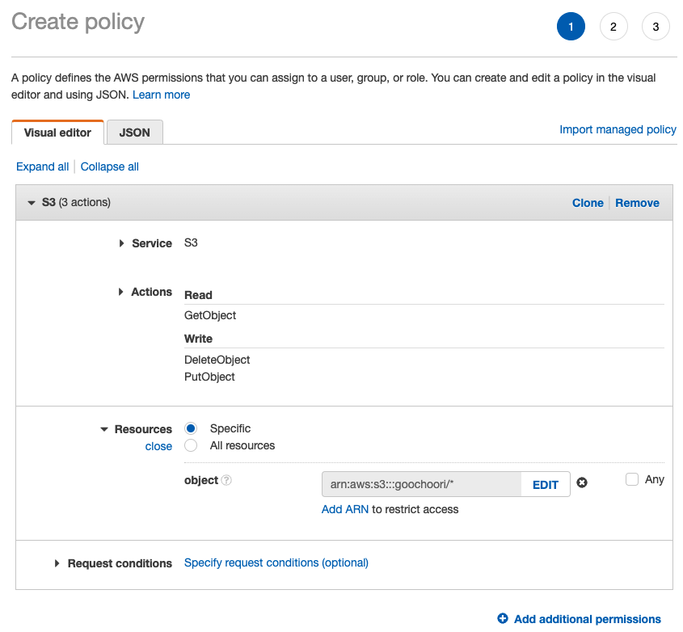
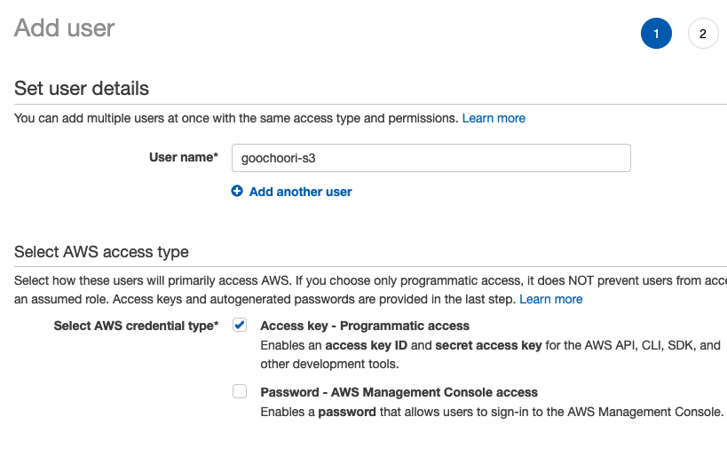
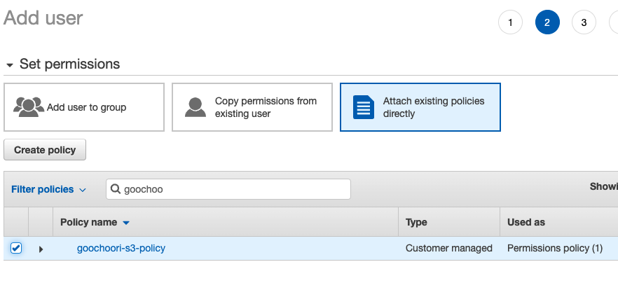
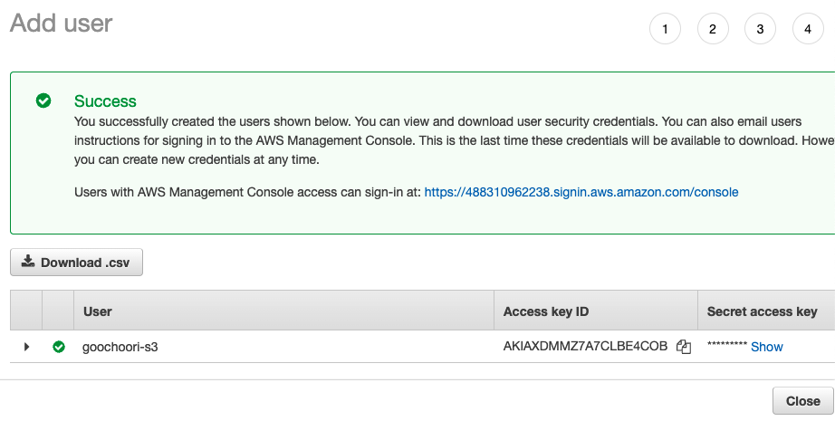

# Goochoori-api

Steps to run:

1. Run `yarn` command
2. Setup `.env` file
3. Run `yarn dev` or `yarn start` command

---

```
mysql> UPDATE place  SET point = ST_GeomFromText(ST_AsText(point), 4326);
ERROR 3617 (22S03): Latitude 127.614066 is out of range in function st_geomfromtext. It must be within [-90.000000, 90.000000].

mysql> select *, ST_astext(point) from place;
+----+--------------------+--------------------+------------------------------------------------------+----------------------------------------------+
| id | latitude           | longitude          | point                                                | ST_astext(point)                             |
+----+--------------------+--------------------+------------------------------------------------------+----------------------------------------------+
|  1 |  37.63834402322471 | 127.61406615168869 | 0x00000000010100000058C51DDC4CE75F4071ACC741B5D14240 | POINT(127.61406615168869 37.63834402322471)  |
|  2 |  36.37288489577353 | 127.07328582850272 | 0x0000000001010000007C2B0BB7B0C45F40854238B1BA2F4240 | POINT(127.07328582850272 36.37288489577353)  |
```

# server 용량 보기

```bash
$ sudo df -h
Filesystem      Size  Used Avail Use% Mounted on
/dev/root        20G  8.5G   11G  44% /
devtmpfs        479M  108K  478M   1% /dev
tmpfs           485M     0  485M   0% /dev/shm
tmpfs            97M  1.1M   96M   2% /run
tmpfs           5.0M     0  5.0M   0% /run/lock
tmpfs           485M     0  485M   0% /sys/fs/cgroup
tmpfs            97M     0   97M   0% /run/user/1000
/dev/loop8       27M   27M     0 100% /snap/amazon-ssm-agent/5163
/dev/loop9       68M   68M     0 100% /snap/lxd/22526
/dev/loop10      56M   56M     0 100% /snap/core18/2344
/dev/loop1       68M   68M     0 100% /snap/lxd/22753
/dev/loop11      56M   56M     0 100% /snap/core18/2409
/dev/loop5       26M   26M     0 100% /snap/amazon-ssm-agent/5656
/dev/loop0       45M   45M     0 100% /snap/snapd/15904
/dev/loop12      62M   62M     0 100% /snap/core20/1494
/dev/loop3       62M   62M     0 100% /snap/core20/1518
/dev/loop6       47M   47M     0 100% /snap/snapd/16010

$ sudo du -max / | sort -rn | head -20
8518	/
3526	/home/ubuntu
3526	/home
3067	/var
1791	/usr
1701	/home/ubuntu/.cache/yarn/v6
1701	/home/ubuntu/.cache/yarn
1701	/home/ubuntu/.cache
1542	/var/lib
1329	/home/ubuntu/projects
1025	/var/swap.1
857	/var/lib/snapd
792	/usr/lib
515	/var/lib/snapd/snaps
419	/home/ubuntu/goochoori_landing
371	/home/ubuntu/goochoori_landing/node_modules
357	/var/log
354	/home/ubuntu/projects/goochoori-hospital
353	/var/log/journal/74418beb9960460fb3d19025c9d39aec
353	/var/log/journal

$ sudo du -max /home/ubuntu/ | sort -rn | head -20
3526	/home/ubuntu/
1701	/home/ubuntu/.cache/yarn/v6
1701	/home/ubuntu/.cache/yarn
1701	/home/ubuntu/.cache
1329	/home/ubuntu/projects
419	/home/ubuntu/goochoori_landing
371	/home/ubuntu/goochoori_landing/node_modules
354	/home/ubuntu/projects/goochoori-hospital
352	/home/ubuntu/projects/goochoori-agency
350	/home/ubuntu/projects/goochoori-admin
349	/home/ubuntu/projects/goochoori-hospital/node_modules
347	/home/ubuntu/projects/goochoori-agency/node_modules
346	/home/ubuntu/projects/goochoori-admin/node_modules
274	/home/ubuntu/projects/goochoori-api
266	/home/ubuntu/projects/goochoori-api/node_modules
74	/home/ubuntu/.cache/yarn/v6/npm-typescript-4.6.4-caa78bbc3a59e6a5c510d35703f6a09877ce45e9-integrity/node_modules/typescript
74	/home/ubuntu/.cache/yarn/v6/npm-typescript-4.6.4-caa78bbc3a59e6a5c510d35703f6a09877ce45e9-integrity/node_modules
74	/home/ubuntu/.cache/yarn/v6/npm-typescript-4.6.4-caa78bbc3a59e6a5c510d35703f6a09877ce45e9-integrity
74	/home/ubuntu/.cache/yarn/v6/npm-typescript-4.6.3-integrity/node_modules/typescript
74	/home/ubuntu/.cache/yarn/v6/npm-typescript-4.6.3-integrity/node_module
```

# s3 presigned-url

https://www.youtube.com/playlist?list=PLcla6S01k_nhO6zm0pIpRuEJEbCl2Xy-5

### make IAM Policy

`IAM > Pollicies > Create Policy`


### make IAM User

`IAM > Users > Create Users`

- `Programmatic access`를 체크해준다.
  

- 앞에서 만든 policy 선택
  

- Access key ID, Secret access key를 복사한다. Secret access key는 이 화면이 지나면 다시 못 보는 것 같음
  
